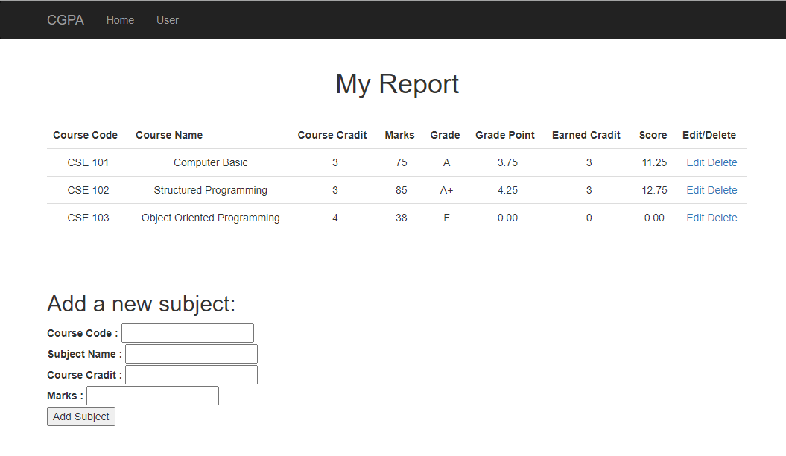

# Python-Flask Grade Point Count Application

 
## 👩🏼‍💻 About
This is project is for MIU students, who want to calculate his/her expected CGPA. 

## 🔧 Built With
- Python (Programming Language)
- HTML/CSS (Markup Language)
- Flask (Python Framework)
- Bootstrap (Front End Framework)
- SQLite (Database)

## 🤖 Getting started

### Pre-requirenments
- Install Python [Link](https://www.python.org/downloads/)
- Set Path [Video (Naim Sir)](https://www.youtube.com/watch?v=EDNpd-7vaJ8&list=PL5WWFMzXof5hA8cLzEoim7BEkHcmddbOK&index=6)
- Install Git (Link) [Video (Naim Sir)](https://git-scm.com/downloads)

### How to run
- TDA

## Author

👤 **A B M Asadullah**

- GitHub: [@abmAsadullah](https://github.com/abmAsadullah)
- Twitter: [@abmAsadullah](https://twitter.com/abmAsadullah)
- LinkedIn: [abmAsadullah](https://www.linkedin.com/in/abmAsadullah)

## 🤝 Contributing

Contributions, issues, and feature requests are welcome!

## ⭐ Show your support

Give a ⭐️ if you like this project!

## 📝 License

This project is [MIT](https://opensource.org/licenses/MIT) licensed.
